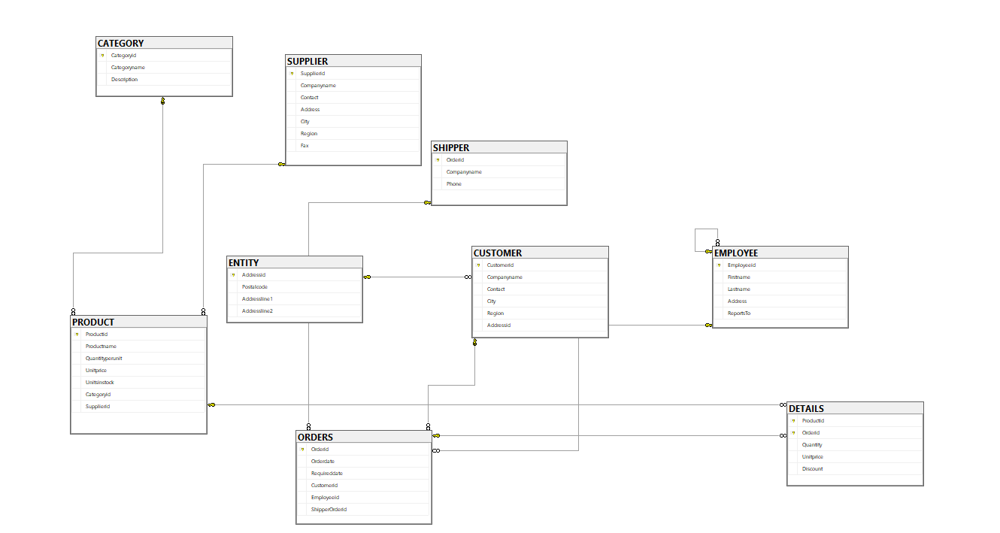

# Category #

```SQL
# Imagenes De Relacionales Category

-- 1. TABLA CATEGORY
CREATE TABLE CATEGORY (
    Categoryid INT PRIMARY KEY,
    Categoryname VARCHAR(50) NOT NULL,
    Description TEXT
);

-- 2. TABLA SUPPLIER
CREATE TABLE SUPPLIER (
    Supplierid INT PRIMARY KEY,
    Companyname VARCHAR(100) NOT NULL,
    Contact VARCHAR(50),
    Address VARCHAR(150),
    City VARCHAR(50),
    Region VARCHAR(50),
    Fax VARCHAR(25)
);

-- 3. TABLA SHIPPER
CREATE TABLE SHIPPER (
    Orderid INT PRIMARY KEY,
    Companyname VARCHAR(100) NOT NULL,
    Phone VARCHAR(25)
);

-- 4. TABLA ENTITY (Direcciones)
CREATE TABLE Entity (
    Addressid INT PRIMARY KEY,
    Postalcode VARCHAR(15),
    Addressline1 VARCHAR(150),
    Addressline2 VARCHAR(150)
);

-- 5. TABLA CUSTOMER
CREATE TABLE CUSTOMER (
    Customerid INT PRIMARY KEY,
    Companyname VARCHAR(100) NOT NULL,
    Contact VARCHAR(50),
    City VARCHAR(50),
    Region VARCHAR(50),
    Addressid INT,
    
    CONSTRAINT FK_Customer_Entity 
        FOREIGN KEY (Addressid) REFERENCES Entity(Addressid)
);

-- 6. TABLA EMPLOYEE (Incluye la auto-relación REPORT_TO)
CREATE TABLE EMPLOYEE (
    Employeeid INT PRIMARY KEY,
    Firstname VARCHAR(50) NOT NULL,
    Lastname VARCHAR(50) NOT NULL,
    Address VARCHAR(150),
    ReportsTo INT,
    
    CONSTRAINT FK_Employee_ReportsTo 
        FOREIGN KEY (ReportsTo) REFERENCES EMPLOYEE(Employeeid)
);

-- 7. TABLA PRODUCT
CREATE TABLE PRODUCT (
    Productid INT PRIMARY KEY,
    Productname VARCHAR(100) NOT NULL,
    Quantityperunit VARCHAR(50),
    Unitprice DECIMAL(10,2) NOT NULL,
    Unitsinstock INT DEFAULT 0,
    Categoryid INT NOT NULL,
    Supplierid INT NOT NULL,
    
    CONSTRAINT FK_Product_Category 
        FOREIGN KEY (Categoryid) REFERENCES CATEGORY(Categoryid),
    CONSTRAINT FK_Product_Supplier 
        FOREIGN KEY (Supplierid) REFERENCES SUPPLIER(Supplierid)
);

-- 8. TABLA ORDERS
CREATE TABLE ORDERS (
    Orderid INT PRIMARY KEY,
    Orderdate DATE NOT NULL,
    Requireddate DATE,
    Customerid INT NOT NULL,
    Employeeid INT NOT NULL,
    ShipperOrderid INT,
    
    CONSTRAINT FK_Orders_Customer 
        FOREIGN KEY (Customerid) REFERENCES CUSTOMER(Customerid),
    CONSTRAINT FK_Orders_Employee 
        FOREIGN KEY (Employeeid) REFERENCES EMPLOYEE(Employeeid),
    CONSTRAINT FK_Orders_Shipper 
        FOREIGN KEY (ShipperOrderid) REFERENCES SHIPPER(Orderid)
);

-- 9. TABLA DETAILS (Relación N:M entre PRODUCT y ORDERS)
-- Nota: 'Total' es un atributo derivado/calculado (Quantity * Unitprice * (1 - Discount))
CREATE TABLE DETAILS (
    Productid INT NOT NULL,
    Orderid INT NOT NULL,
    Quantity INT NOT NULL DEFAULT 1,
    Unitprice DECIMAL(10,2) NOT NULL,
    Discount DECIMAL(4,2) DEFAULT 0.00,
    
    -- Clave Primaria Compuesta
    CONSTRAINT PK_Details PRIMARY KEY (Productid, Orderid),
    
    -- Claves Foráneas
    CONSTRAINT FK_Details_Product 
        FOREIGN KEY (Productid) REFERENCES PRODUCT(Productid),
    CONSTRAINT FK_Details_Orders 
        FOREIGN KEY (Orderid) REFERENCES ORDERS(Orderid)
);
```


