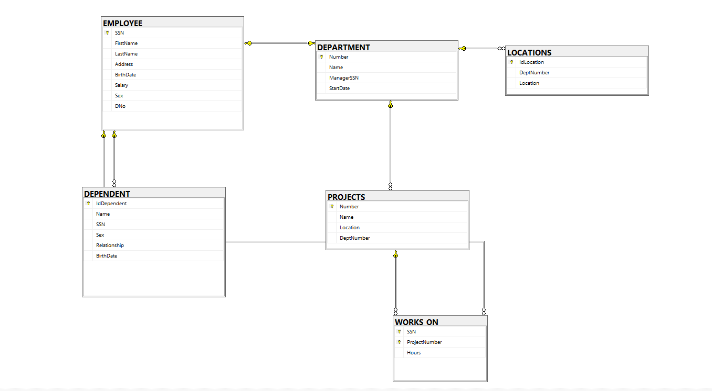

# Employee #

```SQL
# Imagenes De Relacionales Employee

CREATE TABLE EMPLOYEE (
    SSN VARCHAR(11) NOT NULL,
    FirstName VARCHAR(50) NOT NULL,
    LastName VARCHAR(50) NOT NULL,
    Address VARCHAR(150) NULL,
    BirthDate DATE NULL,
    Salary DECIMAL(10,2) NULL,
    Sex CHAR(1) NULL,
    DNo INT NULL, 
    
   
    CONSTRAINT PK_Employee PRIMARY KEY (SSN)
);
GO


CREATE TABLE DEPARTMENT (
    Number INT IDENTITY(1,1) NOT NULL,
    Name VARCHAR(100) NOT NULL,
    ManagerSSN VARCHAR(11) NULL, 
    StartDate DATE NULL,
    
   
    CONSTRAINT PK_Department PRIMARY KEY (Number),
    
   
    CONSTRAINT FK_Department_Manager FOREIGN KEY (ManagerSSN) 
        REFERENCES EMPLOYEE(SSN)
        ON DELETE SET NULL 
        ON UPDATE CASCADE,
        
    CONSTRAINT UQ_Department_Manager UNIQUE (ManagerSSN)
);
GO


ALTER TABLE EMPLOYEE
ADD CONSTRAINT FK_Employee_Department FOREIGN KEY (DNo)
    REFERENCES DEPARTMENT(Number)
    ON DELETE SET NULL
    ON UPDATE CASCADE;
GO


CREATE TABLE PROJECTS (
    Number INT IDENTITY(1,1) NOT NULL,
    Name VARCHAR(100) NOT NULL,
    Location VARCHAR(100) NULL,
    DeptNumber INT NOT NULL,
    
  
    CONSTRAINT PK_Projects PRIMARY KEY (Number),
    
    
    CONSTRAINT FK_Projects_Department FOREIGN KEY (DeptNumber) 
        REFERENCES DEPARTMENT(Number)
        ON DELETE CASCADE 
        ON UPDATE CASCADE
);
GO


CREATE TABLE LOCATIONS (
    IdLocation INT IDENTITY(1,1) NOT NULL,
    DeptNumber INT NOT NULL,
    Location VARCHAR(100) NOT NULL,
    
    
    CONSTRAINT PK_Locations PRIMARY KEY (IdLocation),
    
   
    CONSTRAINT FK_Locations_Department FOREIGN KEY (DeptNumber) 
        REFERENCES DEPARTMENT(Number)
        ON DELETE CASCADE 
        ON UPDATE CASCADE
);
GO


CREATE TABLE DEPENDENT (
    IdDependent INT IDENTITY(1,1) NOT NULL,
    Name VARCHAR(50) NOT NULL,
    SSN VARCHAR(11) NOT NULL,
    Sex CHAR(1) NULL,
    Relationship VARCHAR(50) NULL,
    BirthDate DATE NULL,
    
   
    CONSTRAINT PK_Dependent PRIMARY KEY (IdDependent),
    
  
    CONSTRAINT FK_Dependent_Employee FOREIGN KEY (SSN) 
        REFERENCES EMPLOYEE(SSN)
        ON DELETE CASCADE 
        ON UPDATE CASCADE
);
GO

CREATE TABLE WORKS_ON (
    SSN VARCHAR(11) NOT NULL,
    ProjectNumber INT NOT NULL,
    Hours DECIMAL(5,2) NULL,
    
    CONSTRAINT PK_WorksOn PRIMARY KEY (SSN, ProjectNumber),
    
    CONSTRAINT FK_WorksOn_Employee FOREIGN KEY (SSN) 
        REFERENCES EMPLOYEE(SSN)
        ON DELETE CASCADE 
        ON UPDATE CASCADE,
        
   
    CONSTRAINT FK_WorksOn_Projects FOREIGN KEY (ProjectNumber) 
        REFERENCES PROJECTS(Number)
        ON DELETE NO ACTION 
        ON UPDATE NO ACTION
);
GO
```


