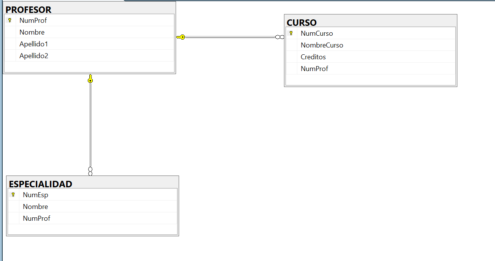

# Profesor #

```SQL
# Imagenes De Relacionales Profesor

CREATE TABLE PROFESOR (
    NumProf INT IDENTITY(1,1) NOT NULL,
    Nombre VARCHAR(50) NOT NULL,
    Apellido1 VARCHAR(50) NOT NULL,
    Apellido2 VARCHAR(50) NULL,

    CONSTRAINT PK_Profesor PRIMARY KEY (NumProf)
);
GO

CREATE TABLE CURSO (
    NumCurso INT IDENTITY(1,1) NOT NULL,
    NombreCurso VARCHAR(100) NOT NULL,
    Creditos INT NOT NULL,
    NumProf INT NOT NULL,
    
   
    CONSTRAINT PK_Curso PRIMARY KEY (NumCurso),

    CONSTRAINT FK_Curso_Profesor FOREIGN KEY (NumProf) 
        REFERENCES PROFESOR(NumProf)
        ON DELETE CASCADE 
        ON UPDATE CASCADE
);
GO

CREATE TABLE ESPECIALIDAD (
    NumEsp INT IDENTITY(1,1) NOT NULL,
    Nombre VARCHAR(100) NOT NULL,
    NumProf INT NOT NULL,
    
    CONSTRAINT PK_Especialidad PRIMARY KEY (NumEsp),
    

    CONSTRAINT FK_Especialidad_Profesor FOREIGN KEY (NumProf) 
        REFERENCES PROFESOR(NumProf)
        ON DELETE CASCADE 
        ON UPDATE CASCADE
);
GO
```


