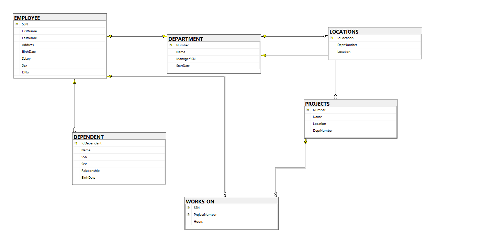

# Projects #

```SQL
# Imagenes De Relacionales de Projects
-- 1. Creación de la tabla EMPLOYEE
CREATE TABLE EMPLOYEE (
    SSN VARCHAR(11) NOT NULL,
    FirstName VARCHAR(50) NOT NULL,
    Address VARCHAR(150) NULL,
    BirthDate DATE NULL,
    Salary DECIMAL(10,2) NULL,
    Sex CHAR(1) NULL,
    DeptNumber INT NULL, -- FK hacia DEPARTMENT (se vincula más adelante)
    
    -- Clave Primaria
    CONSTRAINT PK_Employee PRIMARY KEY (SSN)
);
GO

-- 2. Creación de la tabla DEPARTMENT
CREATE TABLE DEPARTMENT (
    Number INT IDENTITY(1,1) NOT NULL,
    Name VARCHAR(100) NOT NULL,
    Manager VARCHAR(11) NULL, -- Corresponde al SSN del Manager (Relación 1 - 1)
    StartDate DATE NULL,
    
    -- Clave Primaria
    CONSTRAINT PK_Department PRIMARY KEY (Number),
    
    -- Clave Foránea a EMPLOYEE (Manager) con restricción UNIQUE
    CONSTRAINT FK_Department_Manager FOREIGN KEY (Manager) 
        REFERENCES EMPLOYEE(SSN)
        ON DELETE SET NULL 
        ON UPDATE NO ACTION,
        
    CONSTRAINT UQ_Department_Manager UNIQUE (Manager)
);
GO

-- 3. Asignación de la Clave Foránea DeptNumber en EMPLOYEE hacia DEPARTMENT
ALTER TABLE EMPLOYEE
ADD CONSTRAINT FK_Employee_Department FOREIGN KEY (DeptNumber)
    REFERENCES DEPARTMENT(Number)
    ON DELETE SET NULL
    ON UPDATE NO ACTION;
GO

-- 4. Creación de la tabla PROJECTS
CREATE TABLE PROJECTS (
    Number INT IDENTITY(1,1) NOT NULL,
    Name VARCHAR(100) NOT NULL,
    Location VARCHAR(100) NULL,
    DeptNumber INT NOT NULL,
    
    -- Clave Primaria
    CONSTRAINT PK_Projects PRIMARY KEY (Number),
    
    -- Clave Foránea
    CONSTRAINT FK_Projects_Department FOREIGN KEY (DeptNumber) 
        REFERENCES DEPARTMENT(Number)
        ON DELETE CASCADE 
        ON UPDATE CASCADE
);
GO

-- 5. Creación de la tabla LOCATIONS
CREATE TABLE LOCATIONS (
    IdLocation INT IDENTITY(1,1) NOT NULL,
    DeptNumber INT NOT NULL,
    Location VARCHAR(100) NOT NULL,
    
    -- Clave Primaria
    CONSTRAINT PK_Locations PRIMARY KEY (IdLocation),
    
    -- Clave Foránea
    CONSTRAINT FK_Locations_Department FOREIGN KEY (DeptNumber) 
        REFERENCES DEPARTMENT(Number)
        ON DELETE CASCADE 
        ON UPDATE CASCADE
);
GO

-- 6. Creación de la tabla DEPENDENT
CREATE TABLE DEPENDENT (
    IdDependent INT IDENTITY(1,1) NOT NULL,
    Name VARCHAR(50) NOT NULL,
    SSN VARCHAR(11) NOT NULL,
    Sex CHAR(1) NULL,
    Relationship VARCHAR(50) NULL,
    BirthDate DATE NULL,
    
    -- Clave Primaria
    CONSTRAINT PK_Dependent PRIMARY KEY (IdDependent),
    
    -- Clave Foránea
    CONSTRAINT FK_Dependent_Employee FOREIGN KEY (SSN) 
        REFERENCES EMPLOYEE(SSN)
        ON DELETE CASCADE 
        ON UPDATE CASCADE
);
GO

-- 7. Creación de la tabla WORKS_ON (Relación N - M)
CREATE TABLE WORKS_ON (
    SSN VARCHAR(11) NOT NULL,
    ProjectNumber INT NOT NULL,
    Hours DECIMAL(5,2) NULL,
    
    -- Clave Primaria Compuesta
    CONSTRAINT PK_WorksOn PRIMARY KEY (SSN, ProjectNumber),
    
    -- Claves Foráneas
    CONSTRAINT FK_WorksOn_Employee FOREIGN KEY (SSN) 
        REFERENCES EMPLOYEE(SSN)
        ON DELETE CASCADE 
        ON UPDATE CASCADE,
        
    CONSTRAINT FK_WorksOn_Projects FOREIGN KEY (ProjectNumber) 
        REFERENCES PROJECTS(Number)
        ON DELETE NO ACTION 
        ON UPDATE NO ACTION
);
GO

```

